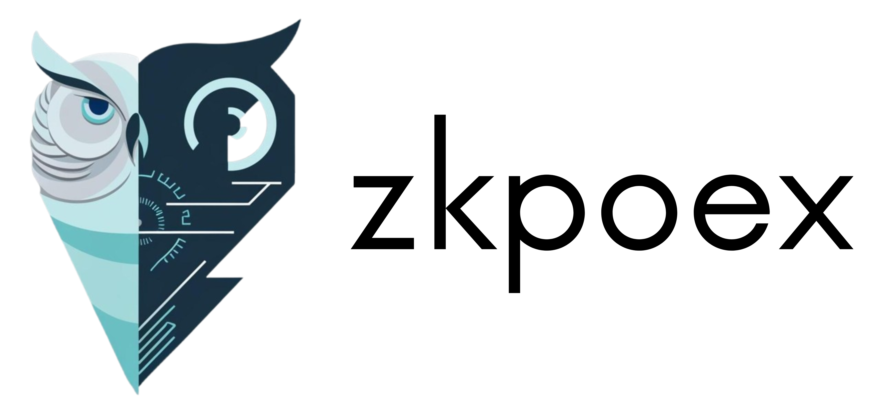
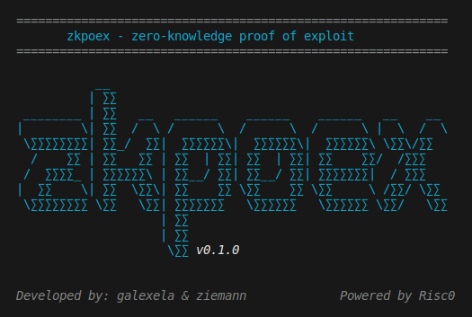

<div align="center">
  
</div>
<br />
<p align="center">
  </img>
  </img>
</p>
<br />

<p align="center">
  <a href="https://discord.gg/2CcG3nYC">
    
  </a>
  <a href="https://t.me/+YkcPPHLFz4dlODlk">
    
  </a>
</p>

---

<div align="center">

[![Stargazers][stars-shield]][stars-url] [![Forks][forks-shield]][forks-url]
[![Contributors][contributors-shield]][contributors-url]
[![Issues][issues-shield]][issues-url]
[![GPL-3.0 License][license-shield]][license-url]

</div>

# zkpoex

**zkpoex** is a Rust-based toolkit for proving exploits using zero-knowledge proofs, specifically designed for **Ethereum** smart contracts. Built on top of [risc0](https://risc0.com/), zkpoex leverages advanced cryptographic techniques to verify exploit execution without revealing sensitive details.

The project is structured as a Cargo workspace with four main members: **host**, **methods**, **evm-runner** and **sc-owner**.
<div>
  
</div>

---

## Table of Contents

- [zkpoex](#zkpoex)
  - [Table of Contents](#table-of-contents)
  - [Protocol Overview](#protocol-overview)
    - [The Prover](#the-prover) 
    - [The Smart Contract Owner](#the-smart-contract-owner)
  - [Features](#features)
  - [Prerequisites](#prerequisites)
  - [Installation](#installation)
  - [Setup \& Build](#setup--build)
  - [Usage](#usage)
    - [Prover](#prover)
      - [Proving an Exploit](#proving-an-exploit)
      - [Compiling Contracts](#compiling-contracts)
      - [Running Tests for the EVM Runner](#running-tests-for-the-evm-runner)
    - [Smart contract owner](#smart-contract-owner)
      - [Verifier Deployment](#verifier-deployment)
  - [Performance Metrics for Exploit Verification Proofs](#performance-metrics-for-exploit-verification-proofs)
    - [Key Metrics](#key-metrics)
  - [Project Structure](#project-structure)
  - [License](#license)

---


## Protocol Overview

zkpoex as a protocol consists of two parties:

- **The prover**
- **The smart contract owner**

### The Prover

The prover finds an exploit in the owner's smart contract and generates a zero-knowledge proof of the exploit execution. To do so, it shows that it knows some calldata that can be used to call the contract such that it breaks the contract's program specification.

The prover can verify said proof and claim rewards automatically **without need for a third party**.

### The Smart Contract Owner

The smart contract owner is responsible for:

- Deploying the verifier contract
- Setting up the program specification
- Defining the rewards for the prover

For more details, check out the [documentation](./docs/0.1.0/DOCS.md) and the following blogpost: [Trustless Bug Bounties with zkpoex: Proving Exploits without Revealing Them](https://ziemann.me/zkpoex/).

---

## Features

- **Zero-Knowledge Proofs:** Use risc0 to generate verifiable zk proofs of exploit execution.
- **EVM Integration:** Interact with an Ethereum Virtual Machine interpreter for proving.
- **Modular Design:** Workspace split into multiple packages for clear separation of concerns.

---

## Prerequisites

- **Rust Toolchain:** Install the latest version from [rustup.rs](https://rustup.rs/).
- **solc (Solidity Compiler):** Required for compiling smart contracts. Install by following the instructions on [Solidity Docs](https://docs.soliditylang.org/en/latest/installing-solidity.html).
- **solc-select:** A tool to quickly switch between Solidity compiler versions. Install via [solc-select repository](https://github.com/crytic/solc-select).
- **Just:** A command runner to streamline common tasks. Install via [Justfile instructions](https://github.com/casey/just).
- **Risc0 SDK:** Follow the installation instructions on [risc0 Docs](https://dev.risczero.com/api/zkvm/install).
- **Foundry:** Install Foundry by following the instructions on [Foundry repository](https://github.com/foundry-rs/foundry).

---

## Installation

1. **Clone the Repository:**

   ```sh
   git clone https://github.com/your-org/zkpoex.git
   cd zkpoex
   ```

2. **Install Dependencies:**

   Ensure you have the Rust toolchain and solc installed. Then, update your Rust dependencies:

   ```sh
   cargo update
   ```

3. **Build the Foundry project**

   This will compile the Solidity contracts and prepare the project for proper operation.

   ```sh
   cd contracts && forge build
   ```

---

## Setup & Build

The project is configured as a Cargo workspace.

**The** current configuration ensures optimized builds for faster execution of proofs.

---

## Usage

### Prover

#### Compiling Contracts

First, you have to compile all the contracts in the foundry project.
Contracts are written in Solidity. Use the provided `justfile` commands to compile them:

```sh
just compile-contract
```

---

#### Running Tests for the EVM Runner

After compiling contracts, you can run the tests for the `evm-runner` package:

```sh
just test-evm
```

---

#### Proving an Exploit

To generate a zero-knowledge proof of an exploit, you can run:

```sh
just prove
```

For more details on running the prove logic, check out the [`host/README.md`](./host/README.md).

**Important**: Beware since the prover has very high requirements

---

### Smart contract owner

#### Verifier Deployment

To deploy a verifier contract, create context_state and program_spec for your project and then deploy. Example:

```bash
just deploy-verifier "./shared/examples/basic-vulnerable/context_state.json" "./shared/examples/basic-vulnerable/program_spec.json" "testnet" "500000000000000000"
```

For more details on this, check out the [`sc-owner/README.md`](./sc-owner/README.md).

### Benchmarks

If you want to collect performance metrics and profiling data for RISC Zero zkVM guest executions, check out the [`scripts/bench/README.md`](./scripts/bench/README.md). Example performance results, including average prover times and verifier costs over 10 runs, are already available in this README under "[Performance Metrics for Exploit Verification Proofs](#performance-metrics)" section.


**Please note:** currently, the benchmarking functions are not fully supported on Linux or other Unix-based systems.

## Performance Metrics for Exploit Verification Proofs

This section contains some example performance results of exploit verification proofs using **zkpoex v0.1.0** with **RISC Zero v2.3**. Prover times represent end-to-end proof generation on an **AWS t3.2xlarge EC2 instance** running Ubuntu, equipped with 8 vCPUs and 32 GiB of RAM.

### Key Metrics

Three key metrics were analyzed:

- **Total cycles**: Measure of computational complexity in the zkVM.
- **Prover time**: Wall-clock time for proof generation.
- **Verifier cost**: Gas consumption for on-chain verification.

For each vulnerability category present in [./shared/examples/](./shared/examples/), **10 independent experimental runs** were carried out. The table below reports the **average values** over the runs for prover runtime (with the standard deviation in parentheses) and the mean verifier cost in term of gas.


| Case Study             | Total Cycles | Prover Time (s) | Verifier Cost (gas) |
|------------------------|-------------:|----------------:|------------------:|
| Logic Vulnerability     | 1,048,576   | 525.0 (±27.4)   | 296,348           |
| Arithmetic Overflow     | 524,288     | 334.6 (±4.2)    | 296,361           |
| Reentrancy Drain        | 2,097,152   | 892.4 (±10.5)   | 296,332           |


## Project Structure

```
zkpoex/
├── Cargo.toml            # Workspace manifest
├── rust-toolchain.toml   # Rust toolchain version used across the workspace
├── .env.example          # Example env file containing the required variables
├── justfile              # Command runner instructions
├── host/                 # Main Crate for host functionalities (zk proving)
├── methods/              # Crate for various zk methods
├── evm-runner/           # Crate to run EVM-related tasks and tests
├── sc-owner/             # Crate to handle contract deployment and on-chain verification from the owner's perspective.
├── scripts/              # Folder that contains the `bench.sh` for collecting performance metrics and profiling data for RISC Zero zkVM guest executions.
├── shared/               # It contains shared data structures, utility functions, and helper methods for working across the creates.
├── contracts/            # Solidity contracts and outputs (bytecode, storage layout)
├── bytecode/             # Bytecode from the contracts
├── docs/                 # Documentations for zkpoex releases
└── README.md             # This file
```

---

## License

[MIT](./LICENSE)

[contributors-shield]: https://img.shields.io/github/contributors/ziemen4/zkpoex
[contributors-url]: https://github.com/ziemen4/zkpoex/graphs/contributors
[forks-shield]: https://img.shields.io/github/forks/ziemen4/zkpoex
[forks-url]: https://github.com/ziemen4/zkpoex/network/members
[stars-shield]: https://img.shields.io/github/stars/ziemen4/zkpoex
[stars-url]: https://github.com/ziemen4/zkpoex/stargazers
[issues-shield]: https://img.shields.io/github/issues/ziemen4/zkpoex
[issues-url]: https://github.com/ziemen4/zkpoex/issues
[license-shield]: https://img.shields.io/github/license/ziemen4/zkpoex?logoColor=%23fff&color=blue
[license-url]: https://github.com/ziemen4/zkpoex/blob/master/LICENSE