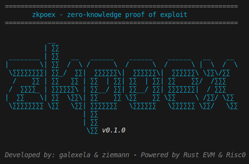

<div align="center">
  
</div>


# zkpoex

**zkpoex** is a Rust-based toolkit for proving exploits using zero-knowledge proofs. Built on top of [risc0](https://risc0.com/), zkpoex leverages advanced cryptographic techniques to verify exploit execution without revealing sensitive details. The project is structured as a Cargo workspace with four main members: **host**, **methods**, **evm-runner** and **sc-owner**.



---

## Table of Contents

- [zkpoex](#zkpoex)
  - [Features](#features)
  - [Prerequisites](#prerequisites)
  - [Installation](#installation)
  - [Setup \& Build](#setup--build)
  - [Usage](#usage)
    - [Proving an Exploit](#proving-an-exploit)
    - [Compiling Contracts](#compiling-contracts)
    - [Running Tests for the EVM Runner](#running-tests-for-the-evm-runner)
  - [Project Structure](#project-structure)
  - [License](#license)

---

## Features

- **Zero-Knowledge Proofs:** Use risc0 to generate verifiable zk proofs of exploit execution.
- **EVM Integration:** Interact with an Ethereum Virtual Machine interpreter for proving.
- **Modular Design:** Workspace split into multiple packages for clear separation of concerns.

---

## Prerequisites

- **Rust Toolchain:** Install the latest version from [rustup.rs](https://rustup.rs/).
- **solc (Solidity Compiler):** Required for compiling smart contracts. Install by following the instructions on [Solidity Docs](https://docs.soliditylang.org/en/latest/installing-solidity.html).
- **solc-select:** A tool to quickly switch between Solidity compiler versions. Install via [solc-select repository](https://github.com/crytic/solc-select).
- **Just:** A command runner to streamline common tasks. Install via [Justfile instructions](https://github.com/casey/just).
- **Risc0 SDK:** Follow the installation instructions on [risc0 Docs](https://dev.risczero.com/api/zkvm/install).
- **Foundry:** Install Foundry by following the instructions on [Foundry repository](https://github.com/foundry-rs/foundry).

---

## Installation

1. **Clone the Repository:**

   ```sh
   git clone https://github.com/your-org/zkpoex.git
   cd zkpoex
   ```

2. **Install Dependencies:**

   Ensure you have the Rust toolchain and solc installed. Then, update your Rust dependencies:

   ```sh
   cargo update
   ```

3. **Build the Foundry project**

   This will compile the Solidity contracts and prepare the project for proper operation.

   ```sh
   cd contracts && forge build
   ```

---

## Setup & Build

The project is configured as a Cargo workspace.

The current configuration ensures optimized builds for faster execution of proofs.

---

## Usage


### Proving an Exploit

To generate a zero-knowledge proof of an exploit, you can run:

```sh
just prove
```

For more details on running the prove logic, check out the [`host/README.md`](./host/README.md).

**Important**: Beware since the prover has very high requirements

---

### Compiling Contracts

Contracts are written in Solidity. Use the provided `justfile` commands to compile them:

```sh
just compile-contract
```

This command is optional because with `just prove` it is fired automatically. It will:

- Compile `BasicVulnerable.sol` and other contracts. The output is stored in the `bytecode` directory.

---

### Running Tests for the EVM Runner

After compiling contracts, you can run the tests for the `evm-runner` package:

```sh
just test-evm
```

---

## Project Structure

```
zkpoex/
├── Cargo.toml            # Workspace manifest
├── rust-toolchain.toml   # Rust toolchain version used across the workspace
├── .env.example          # Example env file containing the required variables
├── justfile              # Command runner instructions
├── host/                 # Main Crate for host functionalities (zk proving)
├── methods/              # Crate for various zk methods
├── evm-runner/           # Crate to run EVM-related tasks and tests
├── sc-owner/             # Crate to handle contract deployment and on-chain verification from the owner's perspective.
├── scripts/              # Folder that contains the `bench.sh` for collecting performance metrics and profiling data for RISC Zero zkVM guest executions.
├── shared/               # It contains shared data structures, utility functions, and helper methods for working across the creates.
├── contracts/            # Solidity contracts and outputs (bytecode, storage layout)
├── bytecode/             # Bytecode from the contracts
├── docs/                 # Documentations for zkpoex releases
└── README.md             # This file
```

---

## License

[MIT License](LICENSE)
